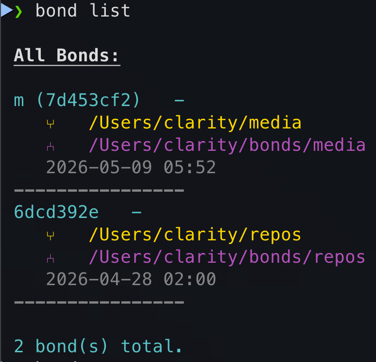
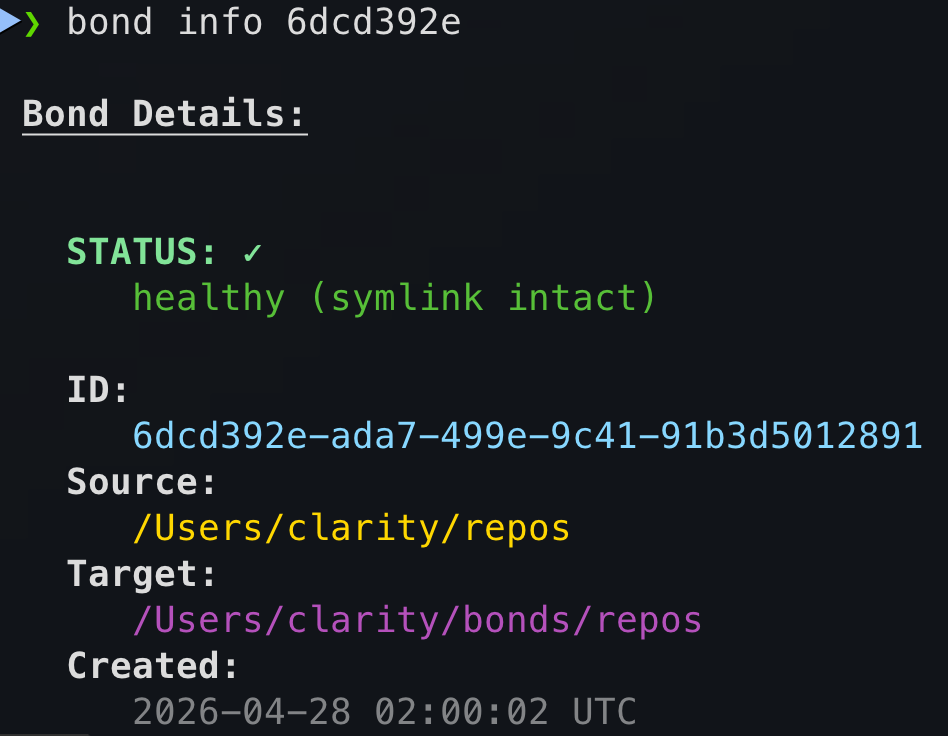
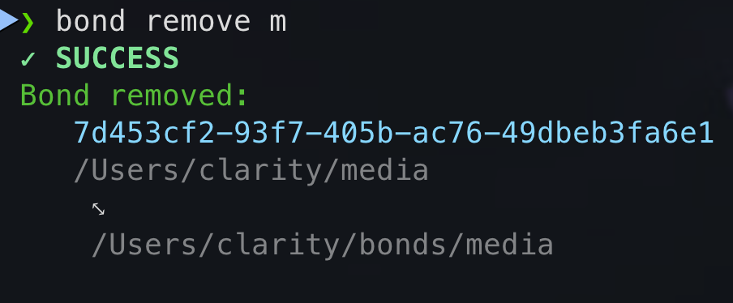

# bonds 

### ⇥ [bonds.fyi](https://bonds.fyi)

Built to ease the organization, management, history, and navigation of files/directories on your computer.

Take a look at the [**roadmap**](https://bonds.fyi/latest/roadmap) for more details on the vision and planned features.

###### [**API Docs**](https://bonds.fyi/latest/library/) | [**Architecture**](https://bonds.fyi/latest/architecture/) | [**Command Line Reference**](https://bonds.fyi/latest/cli/)

[](https://github.com/clxrityy/bonds/actions/workflows/ci.yml) [](https://github.com/clxrityy/bonds/blob/master/LICENSE)

> ---
>
> ##### A tool for creating and managing *bonds* between files and directories
>
> Inspired by the *[`~/dotfiles`](https://dotfiles.github.io) trend*, the power of [symbolic links](https://en.wikipedia.org/wiki/Symbolic_link), and [GNU Stow](https://www.gnu.org/software/stow/).
>
> ---

<table>
  <tr>
    <th>Package</th>
    <th>Latest</th>
  </tr>
  <tr>
    <td>
      <a href="https://bonds.fyi/latest/api/bonds_core/" target="_blank">
        <b>
          <code>bonds-core</code>
        </b>
      </a>
    </td>
    <td>
      <a href="https://bonds.fyi/latest/api/bonds_core/" target="_blank">
        
      </a>
    </td>
  </tr>
  <tr>
    <td>
      <a href="https://bonds.fyi/latest/api/bonds_cli/" target="_blank">
        <b>
          <code>bonds-cli</code>
        </b>
      </a>
    </td>
    <td>
      <a href="https://bonds.fyi/latest/api/bonds_cli/" target="_blank">
        
      </a>
    </td>
  </tr>
</table>

```zsh
brew install clxrityy/tap/bonds
```

---

#### CLI examples

<table>
  <tr>
    <th>Command</th>
    <th>Description</th>
    <th>Example</th>
  </tr>
  <tr>
    <td>
      <code>bond list</code>
    </td>
    <td>List all bonds</td>
    <td>
      <details>
        <summary>
          <b><code>bond-list.png</code></b>
        </summary>
        <a href=".github/img/bond-list.png" target="_blank">
          
        </a>
      </details>
    </td>
  </tr>
  <tr>
    <td>
      <code>bond info &lt;id | name&gt;</code>
    </td>
    <td>Show bond details</td>
    <td>
      <details>
        <summary>
          <b><code>bond-info.png</code></b>
        </summary>
        <a href=".github/img/bond-info.png" target="_blank">
          
        </a>
      </details>
    </td>
  </tr>
  <tr>
    <td>
      <code>bond remove &lt;id | name&gt;</code>
    </td>
    <td>Remove a bond</td>
    <td>
      <details>
        <summary>
          <b><code>bond-remove.png</code></b>
        </summary>
        <a href=".github/img/bond-remove.png" target="_blank">
          
        </a>
      </details>
    </td>
  </tr>
</table>
