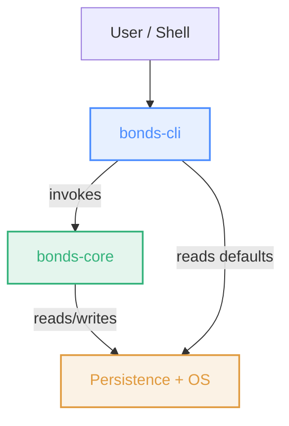
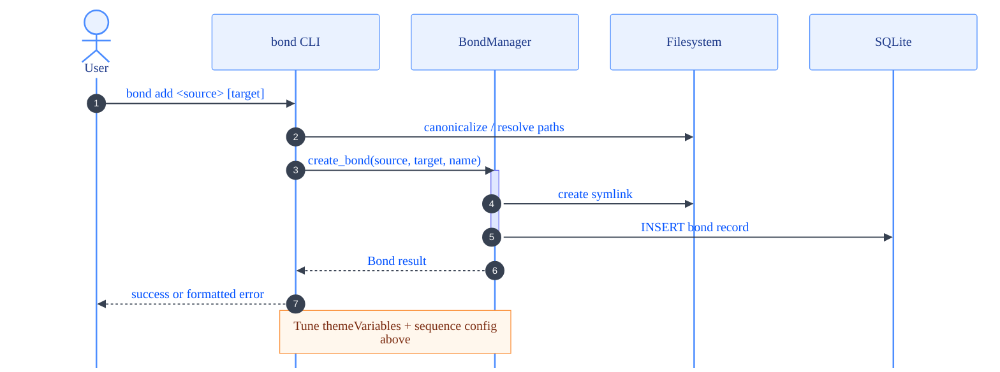
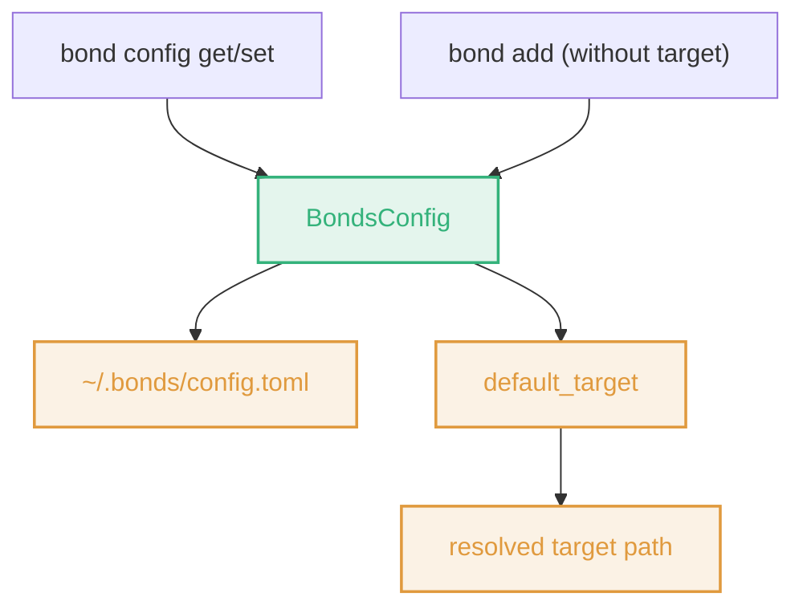

# Bonds | Architecture

> This document provides an overview of the architecture of the Bonds project, including the main components, their interactions, and how they work together to provide the functionality of the tool. The architecture is designed to be modular and extensible, allowing for future enhancements and integrations.

- [High-Level Architecture](#high-level-architecture)
- [Detailed Sequence Diagram](#detailed-sequence-diagram)
- [Config Management](#config-management)

---

## High-Level Architecture

A high-level overview of the main components and their relationships. This is intentionally simple to keep it readable on mobile devices. See the detailed sequence diagram below for more specifics on interactions.

## Detailed Sequence Diagram

This diagram shows a more detailed sequence of interactions for the `bond add` command, including filesystem and database operations.

## Config Management

Config management is a core concern but is kept separate from the main architecture graph to avoid clutter. The `BondsConfig` component handles reading/writing the config file and resolving defaults, which is used by both the CLI and core components.

